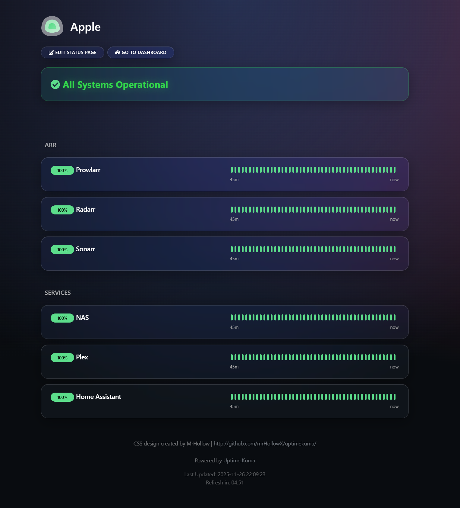
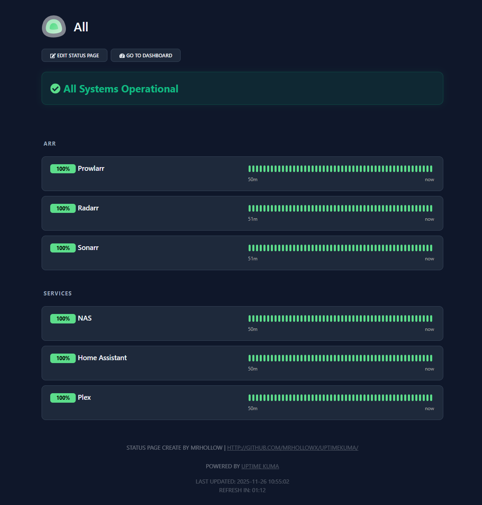

# 🎨 Uptime Kuma Modern Themes

 

A collection of premium, modern CSS themes for [Uptime Kuma](https://github.com/louislam/uptime-kuma) status pages. These themes transform the utilitarian default look into a polished, responsive dashboard.

## 🍏 Option 1: Liquid Glass (Apple Style)
Inspired by **macOS Big Sur** and **VisionOS**. Features a rich "Aurora" liquid background, heavy frosted glass effects, pill-shaped badges, and native system typography.



### Features
* **💧 Liquid Background:** Deep flowing mesh gradient (Purple/Blue/Magenta).
* **🧊 Glassmorphism:** `backdrop-filter: blur(25px)` for realistic frosted glass.
* **🔤 Native Fonts:** Uses San Francisco (Apple) or Segoe UI (Windows).
* **💊 Pill Badges:** Rounded status indicators.

👉 **[Get the CSS here](./apple-theme.css)**

---

## 🌑 Option 2: Modern Dark (Original)
A clean, professional "Slate" theme inspired by **Tailwind CSS**. Features a deep blue-grey palette, the **Inter** font family, and distinct floating cards.



### Features
* **🌚 Deep Slate Palette:** Replaces true black with rich `slate-900` tones.
* **🃏 Floating Cards:** Detaches monitors from groups for a clean layout.
* **✨ Inter Font:** Professional, highly readable typography.
* **🟢 Emerald Accents:** Vibrant green status indicators.

👉 **[Get the CSS here](./darkblue-theme.css)**

---

## 🛠️ Installation

Applying a theme is simple and requires **no server restarts**.

1.  Log in to your **Uptime Kuma** dashboard.
2.  Navigate to **Settings** > **Appearance**.
3.  Scroll down to the **Custom CSS** box.
4.  Copy the CSS code from the file you want (e.g., `apple-theme.css` or `theme.css`).
5.  Paste the code into the box.
6.  Click **Save**.

## 🐛 Troubleshooting

**"My groups still have a dark box behind them."**
These themes explicitly target the `.shadow-box` class used by Uptime Kuma to make group containers invisible so the cards can float freely. 

If you see a dark/grey box behind your groups, ensure you have copied the full CSS, specifically this section which is present in all themes:

```css
.shadow-box, .card {
    background-color: transparent !important;
    box-shadow: none !important;
    border: none !important;
}
